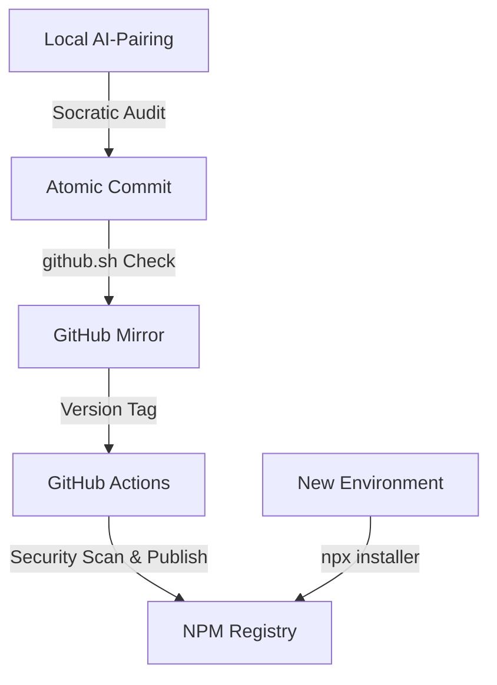

<div align="center">
  <br />
  
  <h1>@wistantkode/dotfiles</h1>
  <p><b>Orchestrating AI-Driven Development through Professional Infrastructure</b></p>
  
  <p>
    <a href="https://www.npmjs.com/package/@wistantkode/dotfiles">
      
    </a>
    <a href="https://pnpm.io">
      
    </a>
    <a href="./LICENSE">
      
    </a>
  </p>
</div>

---

## The Concept: AI-Driven Architecture

Modern development is increasingly AI-pair-programmed. However, without strict guardrails, AI interactions often lead to repository entropy, messy commits, and inconsistent versioning. 

This repository provides the **Architectural Framework** necessary to pilot an AI effectively. It transforms a standard "dotfiles" collection into a set of **Instructional Protocols** that enforce engineering integrity at every step.

---

## Infrastructure Flow

The system ensures that every modification is audited locally before reaching the public registry.



---

## Concrete Value & Assets

### 1. AI Piloting Protocols (`.protocols/`)
A hidden library of instructions that you inject into your AI-Pairing sessions to enforce professional standards:
- **COMMIT.md**: Forces the AI to decompose complex changes into atomic, verifiable intentions.
- **RELEASE.md**: A socratic dialogue to ensure semantic versioning (SemVer) reflects the technical reality.
- **RODIN.md**: The engineering philosophy that prevents AI compliancy and focus-drift.

### 2. Intelligent Synchronization (`github.sh`)
An interactive script that acts as a final gatekeeper. It identifies uncommitted files and "Tag Deltas" (local versions not yet on GitHub) to prevent broken releases.

### 3. Professional Templates
- **Standardized `.gitignore`**: A production-ready model to avoid history pollution.
- **`.gitmessage` Template**: A structured baseline for all commits, compatible with modern changelog generators.
- **NPM Integration**: Every configuration is a versioned package, deployable via `npx` or `pnpm dlx`.

---

## Deployment

Initialize your AI-driven environment on any Linux system:

```bash
pnpm dlx @wistantkode/dotfiles
```

---

## Standards Registry

| Component | Role | Link |
| :--- | :--- | :--- |
| **Integrity Standards** | Engineering philosophy and socratic audit rules. | [RODIN.md](./protocols/RODIN.md) |
| **Commit Rules** | Atomic formatting and Zero-Entropy guardrails. | [COMMIT.md](./protocols/COMMIT.md) |
| **Release Logic** | Step-by-step SemVer validation and sealing. | [RELEASE.md](./protocols/RELEASE.md) |
| **Security Audit** | Vulnerability scanning and secret management. | [SECURITY.md](./protocols/SECURITY.md) |

---

## Licensing

Copyright © 2026 **Wistant**. Distributed under the **Apache License 2.0**.

---

<div align="center">
  <p>Engineered for professional AI-Pairing by <b>@wistantkode</b></p>
</div>
