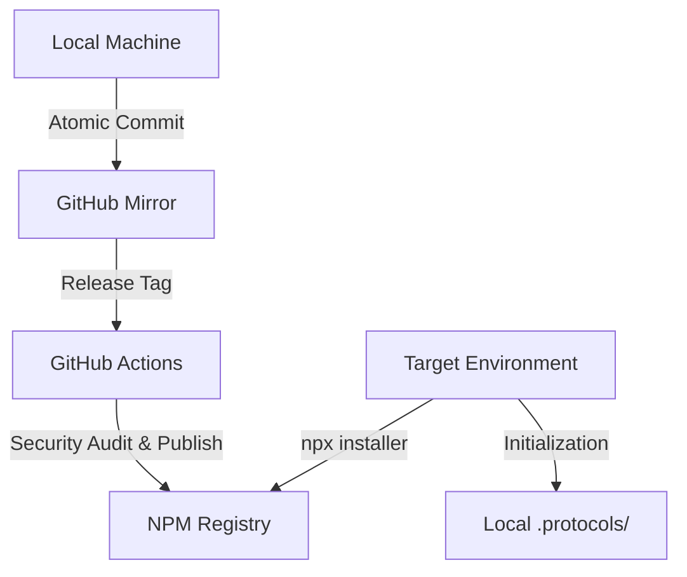

<div align="center">
  <br />
  
  <h1>@wistantkode/dotfiles</h1>
  <p><b>Infrastructure-as-Code — System Protocols & Automated Synchronization</b></p>
  
  <p>
    <a href="https://www.npmjs.com/package/@wistantkode/dotfiles">
      
    </a>
    <a href="https://pnpm.io">
      
    </a>
    <a href="./LICENSE">
      
    </a>
  </p>
</div>

---

## Infrastructure Architecture

This repository operates as an automated distribution system for personal Linux environments. It treats configuration as an engineering asset, governed by strict socratic and architectural protocols.



### System Components

- **Synchronization Module (`github.sh`)**: An interactive synchronizer performing Tag Delta audits and branch state verification before any remote projection.
- **Architectural Protocols**: Technical guides located in `.protocols/` that enforce atomic history and engineering integrity.
- **Automated Pipeline**: CI/CD workflows ensuring every public release is audited, secure, and distributed via NPM.

---

## Deployment

Deploy the infrastructure baseline on any Linux environment:

```bash
pnpm dlx @wistantkode/dotfiles
```

*Note: The installer manages the creation of local protocols and the staging of configuration templates.*

---

## Automation Suite

| Feature | Technical Logic | Operational Outcome |
| :--- | :--- | :--- |
| **Integrity Sync** | `github.sh` | Prevents remote projection without validated tag alignment. |
| **Atomic Commit** | `COMMIT.md` | Enforces a sequence of verifiable intentions over bulk commits. |
| **Technical Release** | `RELEASE.md` | Socratic validation of version increments (SemVer). |
| **System Installer** | `bin/cli.mjs` | Handles the secure deployment of configuration assets. |

---

## Engineering Standards

The project is governed by strict technical standards:

- **[RODIN.md](./protocols/RODIN.md)**: Socratic auditing and engineering philosophy.
- **[SECURITY.md](./protocols/SECURITY.md)**: Vulnerability management and secret scanning rules.
- **[INDEX](./protocols/_INDEX.md)**: Global registry for all system protocols.

---

## Licensing

Copyright © 2026 **Wistant**.  
Licensed under the **Apache License 2.0**. See the [LICENSE](./LICENSE) file for the full text.

---

<div align="center">
  <p>Repository maintained by <b>@wistantkode</b></p>
</div>
