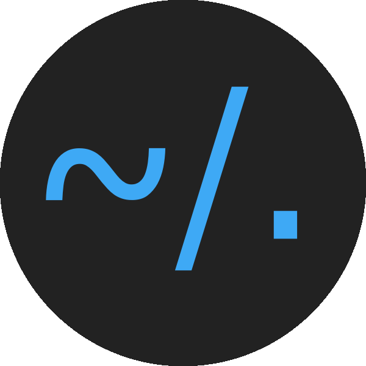
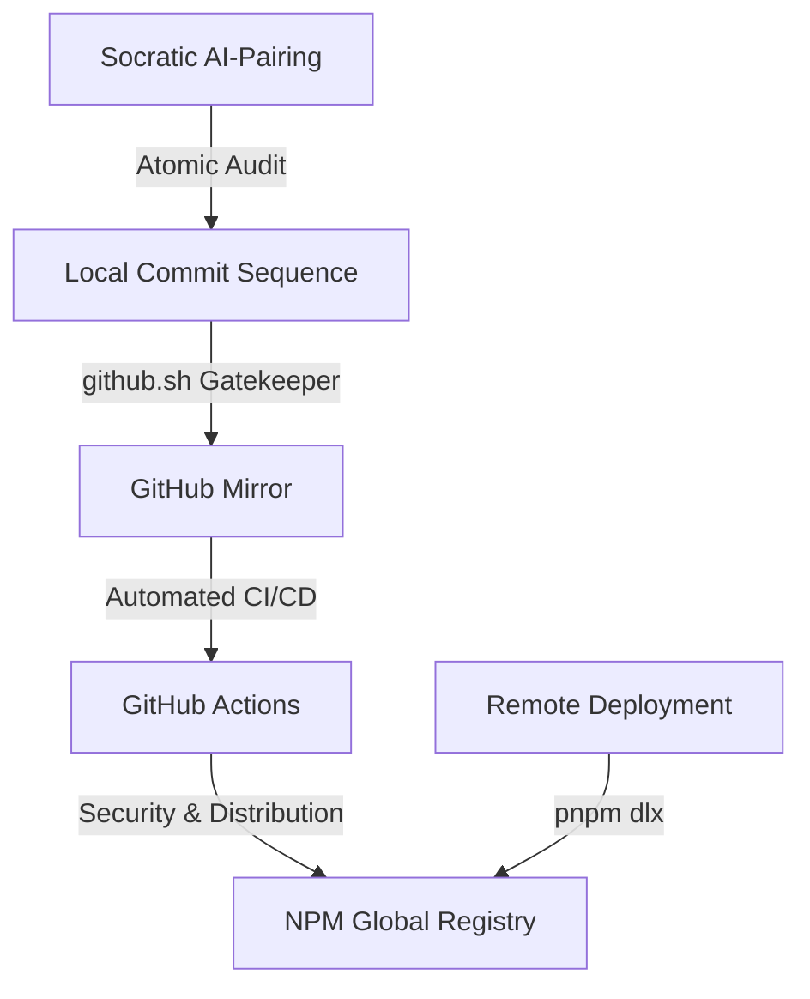

# [@wistantkode/dotfiles](https://www.npmjs.com/package/@wistantkode/dotfiles)

<div align="center">
  <table border="0" cellpadding="0" cellspacing="0">
    <tr>
      <td align="center" valign="middle">
        
      </td>
      <td align="center" valign="middle" style="padding: 0 40px;">
        
      </td>
      <td align="center" valign="middle">
        
      </td>
    </tr>
  </table>
  <br />
  <p><b>Precision AI-Pairing Infrastructure & Architectural Protocols</b></p>
  
  <p>
    <a href="https://www.npmjs.com/package/@wistantkode/dotfiles">
      
    </a>
    <a href="https://pnpm.io">
      
    </a>
    <a href="./LICENSE">
      
    </a>
  </p>
</div>

---

## Infrastructure Orchestration

This is more than a dotfiles collection; it is a **System of Governance** for AI-driven development workflows. By treating your environment as **Versioned Infrastructure**, you establish the necessary guardrails to ensure that AI-pair-programming remains precise, atomic, and secure.

### The System Advantage

- **AI-Driven Logic**: The system is designed to "pilot" your AI assistant. It provides the architectural context and socratic protocols (`.protocols/`) required for high-end decision making.
- **Atomic Reliability**: Every modification is routed through a verification cycle that prevents history pollution and mixed intentions.
- **Universal Staging**: Powered by **pnpm**, **JavaScript (ESM)**, and **Shell orchestration**, the entire ecosystem is instantly deployable via `npx` or `pnpm dlx`.

---

## Operational Workflow



### Core Automation Tools

1. **Interactive Sync (`github.sh`)**: A specialized gatekeeper that performs a "Tag Delta" audit, ensuring local versions and remote states are synchronized before any projection.
2. **System Protocols**: A library of hidden guides that force the AI to maintain professional standards (Atomic commits, Socratic releases, Security first).
3. **Automated Distribution**: GitHub Actions handle the security auditing and global NPM publication upon Every GitHub Release.

---

## Practical Implementation

Deploy your architectural baseline anywhere:

```bash
pnpm dlx @wistantkode/dotfiles
```

### Included Assets
- **Professional `.gitignore`**: PRODUCTION-READY baseline for all modern stacks.
- **Security & Integrity**: Injected `.protocols/` folder for immediate AI alignment.
- **Universal License**: Apache 2.0 baseline for all technical distributions.

---

## Engineering Standards

| Standard | Role | Reference |
| :--- | :--- | :--- |
| **Audit Philosophy** | Socratic auditing and architectural integrity. | [RODIN.md](./protocols/RODIN.md) |
| **Commit Protocol** | Strict atomic formatting and zero-entropy staging. | [COMMIT.md](./protocols/COMMIT.md) |
| **Release Flow** | Socratic versioning and manual sealing logic. | [RELEASE.md](./protocols/RELEASE.md) |
| **Security First** | Vulnerability audits and secret scanning protocols. | [SECURITY.md](./protocols/SECURITY.md) |

> See [_INDEX.md](./protocols/_INDEX.md) for the full library of orchestration protocols.

---

## License

Copyright © 2026 **Wistant**. Distributed under the **Apache License 2.0**.

---

<div align="center">
  <p>Engineered for professional AI-Pairing by <b>@wistantkode</b></p>
</div>
