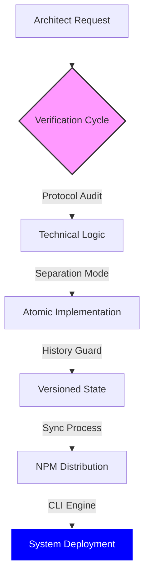

<div align="center">
  

# Precision Dotfiles Infrastructure

  [ Automated Orchestration • AI-Driven Logic • Governance Protocols • CLI Distribution ]

  <p>
    <a href="https://www.npmjs.com/package/@wistantkode/dotfiles">
      
    </a>
    <a href="https://pnpm.io">
      
    </a>
    <a href="./LICENSE">
      
    </a>
  </p>

  [](./protocols/COMMIT.md)
  [](./protocols/RELEASE.md)
  [](./protocols/SECURITY.md)

</div>

---

## Architectural Orchestration

This repository is not just a collection of configs; it is a **Living Governance System**. Every interaction between the Architect and the AI is filtered through a rigorous protocol stack.



### Core Automation Tools

1. **Interactive Sync (`github.sh`)**: A specialized gatekeeper that performs a "Tag Delta" audit, ensuring local versions and remote states are synchronized before any projection.
2. **System Protocols**: A library of hidden guides that force the AI to maintain professional standards (Atomic commits, Protocol releases, Security first).
3. **Automated Distribution**: GitHub Actions handle the security auditing and global NPM publication upon Every GitHub Release.

---

## Practical Implementation

Deploy your architectural baseline anywhere:

```bash
pnpm dlx @wistantkode/dotfiles
```

### Included Assets

- **Professional `.gitignore`**: PRODUCTION-READY baseline for all modern stacks.
- **Security & Integrity**: Injected `.protocols/` folder for immediate AI alignment.
- **Universal License**: Apache 2.0 baseline for all technical distributions.

---

## Engineering Standards

| Standard | Role | Reference |
| :--- | :--- | :--- |
| **Audit Philosophy** | Protocol auditing and architectural integrity. | [RODIN.md](./protocols/RODIN.md) |
| **Commit Protocol** | Strict atomic formatting and zero-entropy staging. | [COMMIT.md](./protocols/COMMIT.md) |
| **Release Flow** | Technical versioning and manual sealing logic. | [RELEASE.md](./protocols/RELEASE.md) |
| **Security First** | Vulnerability audits and secret scanning protocols. | [SECURITY.md](./protocols/SECURITY.md) |

> See [_INDEX.md](./protocols/_INDEX.md) for the full library of orchestration protocols.

---

## License

Copyright © 2026 **Wistant**. Distributed under the **Apache License 2.0**.

---

## Community

See [CONTRIBUTING.md](CONTRIBUTING.md) for guidelines, maintainers, and how to submit PRs.
AI/vibe-coded PRs welcome! 🤖

Special thanks to [Mario Zechner](https://mariozechner.at/) for his support and for
[pi-mono](https://github.com/badlogic/pi-mono).
Special thanks to Adam Doppelt for lobster.bot.

Thanks to all clawtributors:

<p align="left">
  <a href="https://github.com/steipete"></a> <a href="https://github.com/vincentkoc"></a> <a href="https://github.com/vignesh07"></a> <a href="https://github.com/obviyus"></a> <a href="https://github.com/mbelinky"></a> <a href="https://github.com/sebslight"></a> <a href="https://github.com/gumadeiras"></a> <a href="https://github.com/Takhoffman"></a> <a href="https://github.com/thewilloftheshadow"></a> <a href="https://github.com/cpojer"></a>
  <a href="https://github.com/tyler6204"></a> <a href="https://github.com/joshp123"></a> <a href="https://github.com/Glucksberg"></a> <a href="https://github.com/mcaxtr"></a> <a href="https://github.com/quotentiroler"></a> <a href="https://github.com/osolmaz"></a> <a href="https://github.com/Sid-Qin"></a> <a href="https://github.com/joshavant"></a> <a href="https://github.com/shakkernerd"></a> <a href="https://github.com/bmendonca3"></a>
  <a href="https://github.com/mukhtharcm"></a> <a href="https://github.com/zerone0x"></a> <a href="https://github.com/mcinteerj"></a> <a href="https://github.com/ngutman"></a> <a href="https://github.com/lailoo"></a> <a href="https://github.com/arosstale"></a> <a href="https://github.com/rodrigouroz"></a> <a href="https://github.com/robbyczgw-cla"></a> <a href="https://github.com/0xRaini"></a> <a href="https://github.com/Clawborn"></a>
  <a href="https://github.com/yinghaosang"></a> <a href="https://github.com/BunsDev"></a> <a href="https://github.com/christianklotz"></a> <a href="https://github.com/echoVic"></a> <a href="https://github.com/coygeek"></a> <a href="https://github.com/roshanasingh4"></a> <a href="https://github.com/mneves75"></a> <a href="https://github.com/joaohlisboa"></a> <a href="https://github.com/bohdanpodvirnyi"></a> <a href="https://github.com/Nachx639"></a>
  <a href="https://github.com/onutc"></a> <a href="https://github.com/VeriteIgiraneza"></a> <a href="https://github.com/widingmarcus-cyber"></a> <a href="https://github.com/akramcodez"></a> <a href="https://github.com/aether-ai-agent"></a> <a href="https://github.com/bjesuiter"></a> <a href="https://github.com/MaudeBot"></a> <a href="https://github.com/YuriNachos"></a> <a href="https://github.com/chilu18"></a> <a href="https://github.com/byungsker"></a>
  <a href="https://github.com/dbhurley"></a> <a href="https://github.com/JayMishra-source"></a> <a href="https://github.com/iHildy"></a> <a href="https://github.com/mudrii"></a> <a href="https://github.com/dlauer"></a> <a href="https://github.com/Solvely-Colin"></a> <a href="https://github.com/czekaj"></a> <a href="https://github.com/advaitpaliwal"></a> <a href="https://github.com/lc0rp"></a> <a href="https://github.com/grp06"></a>
</p>

---

<div align="center">
  <b>Designed for the 0.1% — Engineered by @wistant</b>
</div>
