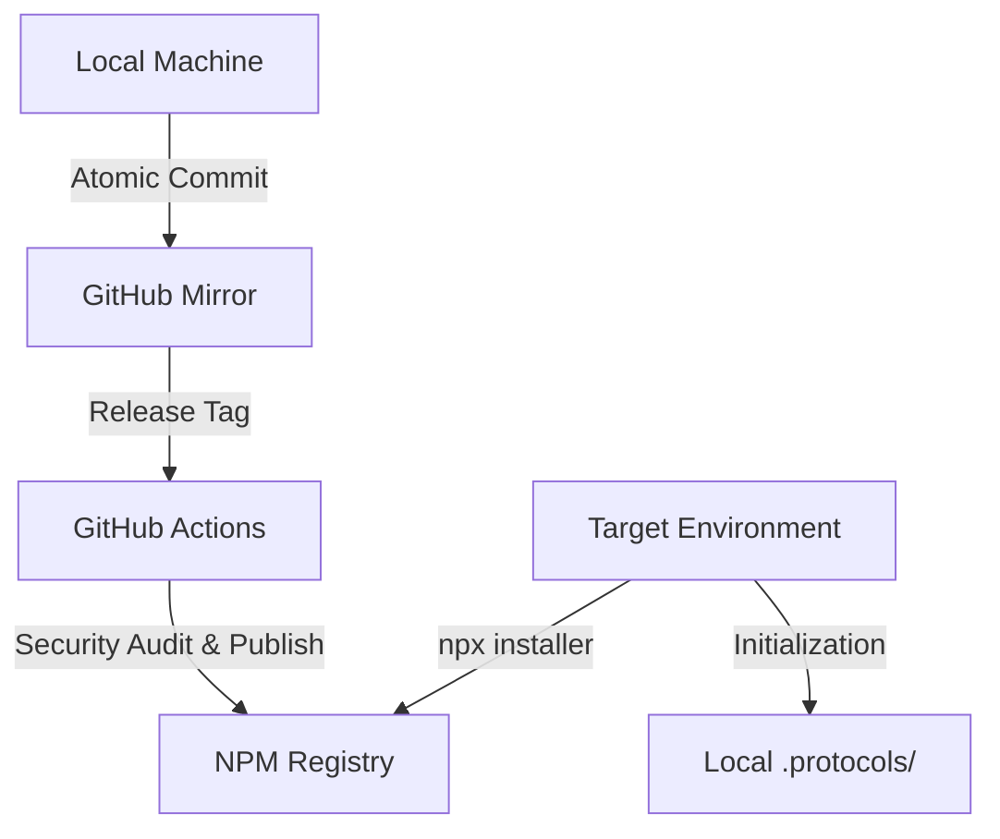

<div align="center">
  <br />
  
  <h1>@wistantkode/dotfiles</h1>
  <p><b>High-End Engineering Infrastructure & Socratic Protocols</b></p>
  
  <p>
    <a href="https://www.npmjs.com/package/@wistantkode/dotfiles">
      
    </a>
    <a href="https://pnpm.io">
      
    </a>
    <a href="./LICENSE">
      
    </a>
  </p>
</div>

---

## 🏛️ The Infrastructure Architecture

Contrary to standard dotfiles, this repository functions as an **Automated Distribution System**. It treats your configuration as **Infrastructure-as-Code**, governed by strict engineering standards.



### Core Components

- **Smart Oracle (`github.sh`)**: An interactive synchronizer that performs a "Tag Delta" audit before any projection to GitHub.
- **Integrity Protocols**: A set of hidden guides (`.protocols/`) that force the AI and the user to maintain a pure, atomic history.
- **CI/CD Pipeline**: fully automated distribution workflow ensuring every public version is audited and secure.

---

## 🚀 Instant Deployment

Deploy your professional baseline on any Linux environment without cloning:

```bash
pnpm dlx @wistantkode/dotfiles
```

---

## 🛠️ The Intelligence Suite

| Feature | Logic | Outcome |
| :--- | :--- | :--- |
| **Interactive Sync** | `github.sh` | Prevents pushing to production without sealed tags or pure history. |
| **Atomic Commitment** | `COMMIT.md` | Forces a sequence of small, verifiable intentions over "everything" commits. |
| **Socratic Release** | `RELEASE.md` | A structured dialogue to justify Major/Minor/Patch increments. |
| **Integrity Audit** | `bin/cli.mjs` | Transparently handles the transformation of files during installation. |

---

## 📜 Professional Standards

The system is powered by the **Rodin Engineering Philosophy** :

- **[RODIN.md](./protocols/RODIN.md)** : The philosophical anchor (Anti-compliancy, Socratic auditing).
- **[SECURITY.md](./protocols/SECURITY.md)** : Vulnerability management and secret scanning.
- **[INDEX](./protocols/_INDEX.md)** : Navigation across all architectural protocols.

---

## ⚖️ Licensing & Legal

Copyright © 2026 **Wistant**.  
Everything in this repository is licensed under the **Apache License 2.0**.

---

<div align="center">
  <p>Engineered for  with <b>@wistantkode</b></p>
</div>
