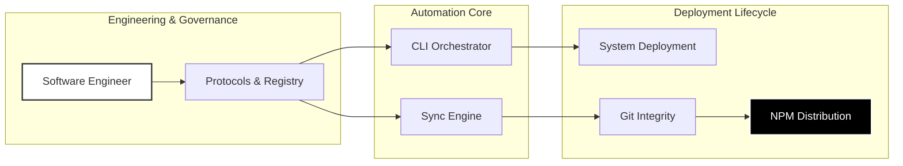

<div align="center">
  

# Precision Dotfiles Infrastructure

  [ Automated Orchestration • AI-Driven Logic • System Governance • CLI Distribution ]

  <p>
    <a href="https://pnpm.io">
       
    </a>
    <a href="https://developer.mozilla.org/en-US/docs/Web/JavaScript">
       
    </a>
    <a href="https://www.npmjs.com/package/@wistantkode/dotfiles">
       
    </a>
    <a href="https://github.com/wistant/dotfiles/actions">
       
    </a>
    <a href="https://github.com/wistant/dotfiles/releases">
       
    </a>
  </p>

</div>

---

## Architectural Orchestration

This repository is not just a collection of configs; it is a **Living Governance System**. Every interaction between the Architect and the AI is filtered through a rigorous protocol stack.



### Core Automation Tools

1. **Interactive Sync (`github.sh`)**: A specialized gatekeeper that performs a "Tag Delta" audit, ensuring local versions and remote states are synchronized before any projection.
2. **System Protocols**: A library of hidden guides that force the AI to maintain professional standards (Atomic commits, Protocol releases, Security first).
3. **Automated Distribution**: GitHub Actions handle the security auditing and global NPM publication upon Every GitHub Release.

---

## Practical Implementation

Deploy your architectural baseline anywhere:

```bash
pnpm dlx @wistantkode/dotfiles
```

### Included Assets

- **Professional `.gitignore`**: PRODUCTION-READY baseline for all modern stacks.
- **Security & Integrity**: Injected `.protocols/` folder for immediate AI alignment.
- **Universal License**: Apache 2.0 baseline for all technical distributions.

---

## Engineering Standards

| Standard | Role | Reference |
| :--- | :--- | :--- |
| **Audit Philosophy** | Protocol auditing and architectural integrity. | [RODIN.md](./protocols/RODIN.md) |
| **Commit Protocol** | Strict atomic formatting and zero-entropy staging. | [COMMIT.md](./protocols/COMMIT.md) |
| **Release Flow** | Technical versioning and manual sealing logic. | [RELEASE.md](./protocols/RELEASE.md) |
| **Security First** | Vulnerability audits and secret scanning protocols. | [SECURITY.md](./protocols/SECURITY.md) |

> See [_INDEX.md](./protocols/_INDEX.md) for the full library of orchestration protocols.

---

## Contributors

The project is currently orchestrated by its lead software engineer. New contributions are welcome to expand the baseline.

<p align="left">
  <a href="https://github.com/wistant">
    
  </a>
</p>

---

## Community

See [CONTRIBUTING.md](CONTRIBUTING.md) for guidelines on how to join the **contributors** and submit PRs.
AI/vibe-coded PRs welcome! 🤖

---

## License

Copyright © 2026 **Wistant**. Distributed under the **Apache License 2.0**.

---
